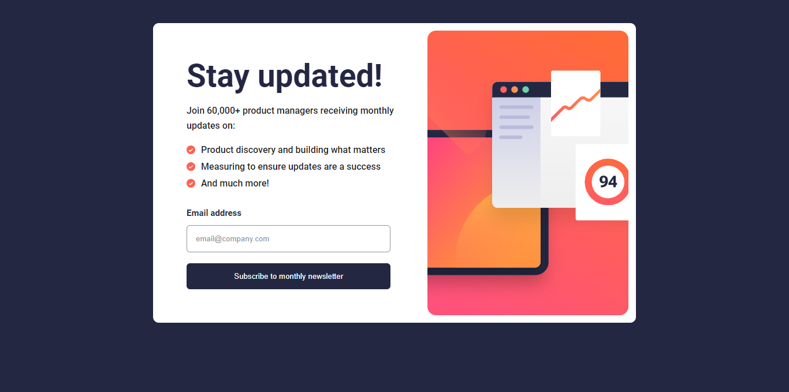

# Frontend Mentor - Newsletter sign-up form with success message solution

This is a solution to the [Newsletter sign-up form with success message challenge on Frontend Mentor](https://www.frontendmentor.io/challenges/newsletter-signup-form-with-success-message-3FC1AZbNrv). Frontend Mentor challenges help you improve your coding skills by building realistic projects. 

## Table of contents

- [Overview](#overview)
  - [The challenge](#the-challenge)
  - [Screenshot](#screenshot)
  - [Links](#links)
- [My process](#my-process)
  - [Built with](#built-with)
  - [What I learned](#what-i-learned)
  - [Continued development](#continued-development)
  - [Useful resources](#useful-resources)
- [Author](#author)
- [Acknowledgments](#acknowledgments)

**Note: Delete this note and update the table of contents based on what sections you keep.**

## Overview

### The challenge

Users should be able to:

- Add their email and submit the form
- See a success message with their email after successfully submitting the form
- See form validation messages if:
  - The field is left empty
  - The email address is not formatted correctly
- View the optimal layout for the interface depending on their device's screen size
- See hover and focus states for all interactive elements on the page

### Screenshot



### Links

- Solution URL: [(https://newsletter-signupmain.netlify.app)]

## My process

### Built with

- Semantic HTML5 markup
- CSS custom properties
- Flexbox
- CSS Grid
- Mobile-first workflow
- Javascript (DOM)

### What I learned

I learned how to use images as list bullets, which enhanced the visual appeal of my lists. I also gained an understanding of regular expressions, which proved invaluable for form validation. Additionally, I became familiar with the oninput event, allowing for real-time input handling.

```css
.proud-of-this-css {
  order: -1;
  /* The order property specifies the order of a flexible item relative to the rest of the flexible items inside the same container. */

  user-select: none;
  /* It prevents users from selecting text or elements */
}
```
```js
const proudOfThisFunc = () => {
  oninput="checker()";
  // The oninput event occurs when an element gets input. The oninput event occurs when the value of an <input> or <textarea> or <select> element is changed.
}
```
### Continued development

I plan to delve deeper into the flex property and improve my skills in creating responsive designs. I will continue my frontend journey by working on more projects that incorporate JavaScript functionality.

### Useful resources
 
- [(www.youtube.com/@CodingArtist)] - He helped me with the form validation. I highly recommend his channel for free HTML, CSS and Javascript tutorials along with practical examples. He's a great guy!

## Author

- Website - I don't have one yet
- Frontend Mentor - [(https://www.frontendmentor.io/profile/jaameyaw)]
- Instagram - [(https://www.instagram.com/johnson_ameyaw)]

## Acknowledgments
Maryam1982 on Github [(https://github.com/Maryam1982)]. Her code snippet helped me with the responsiveness.
